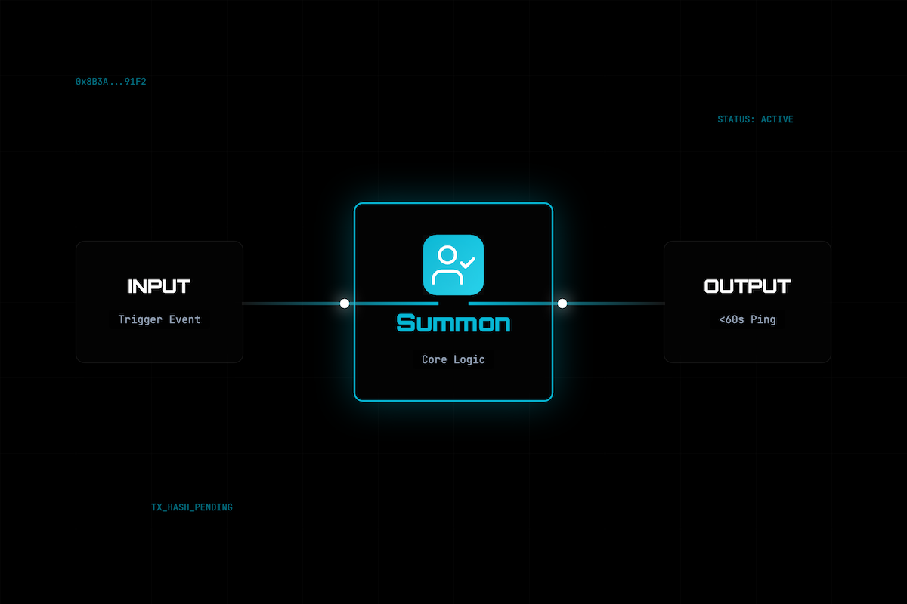

<div align="center">
  

  <h1>Summon 👤</h1>
  <p><em>Human-in-the-loop sign-off agent — any agent hires Summon to get a human Approve/Reject via Telegram</em></p>
  

  <br/>

  [](https://mock.croo.network)
  [](https://dorahacks.io)

  <br/>

  
  
  [](https://github.com/edycutjong/summon/actions/workflows/ci.yml)

</div>

---

## 📸 See it in Action

<div align="center">
  
</div>

> **The Human-in-the-Loop Workflow.** Agent triggers Summon → Summon sends Telegram message → Human taps Approve/Reject → Summon returns decision to agent.

---

## 💡 The Problem & Solution
Fully autonomous agents can make costly mistakes. Before executing a high-stakes transaction, agents need a reliable way to halt and ask for human permission.
**Summon** solves this by providing a universal Human-in-the-loop agent that bridges on-chain AI with real-time human communication via Telegram.

**Key Features:**
- ⚡ **Instant Notification:** Pushes agent requests directly to your Telegram.
- 🔒 **Secure Sign-off:** Only authorized Telegram users can approve or reject.
- 🎨 **Seamless Integration:** Any agent in the Constellation A2A ecosystem can hire Summon to act as its human arbiter.

## 🏗️ Architecture & Tech Stack

| Layer | Technology |
|---|---|
| **Runtime** | Node.js (TypeScript) |
| **Messaging** | Telegram Bot API |
| **Ecosystem** | Constellation A2A (croo-core) |
| **Testing** | Vitest |

## 🚀 Getting Started

### Prerequisites
- Node.js ≥ 20
- npm
- A Telegram Bot Token (from @BotFather)

### Installation
1. Clone: `git clone https://github.com/edycutjong/summon.git`
2. Install: `npm install`
3. Configure: `cp .env.example .env.local` and add your `TELEGRAM_BOT_TOKEN`
4. Run: `npm run dev`

> **For Judges:** Skip account creation! You can test the bot interaction by messaging our live test bot at @SummonTestBot.

## 🧪 Testing & CI

**4-stage pipeline:** Quality → Security → Build → Deploy Gate

```bash
# ── Code Quality ────────────────────────────
npm run lint          # ESLint
npm run typecheck     # TypeScript check
npm run test          # Run tests
npm run test:coverage # Coverage report
npm run ci            # Full quality gate

# ── Security ────────────────────────────────
make security-scan    # npm audit + license check
```

| Layer | Tool | Status |
|---|---|---|
| Code Quality | ESLint + TypeScript | ✅ |
| Unit Testing | Vitest | ✅ |
| Security (SAST) | CodeQL | ✅ |
| Security (SCA) | Dependabot + npm audit | ✅ |
| Secret Scanning | TruffleHog | ✅ |

## 📁 Project Structure
```text
dorahacks-croo-summon/
├── docs/              # README assets (screenshots)
├── src/               # Application source code
├── scripts/           # Build and run scripts
├── __tests__/         # Vitest test suites
├── .env.example       # Environment template
├── .github/           # CI workflows
└── README.md          # You are here
```

## 📄 License
[MIT](LICENSE) © 2026 Edy Cu

## 🙏 Acknowledgments
Built for the DoraHacks CROO Hackathon 2026.

## 🛡️ Hackathon "Demo Insurance" (Copy-Paste Integration)

**Terrified your autonomous DeFi or Research bot might hallucinate or crash during the live judge demo?** 

Add this 5-line `Summon` snippet to your error-catching block. If your bot hits a wall, it autonomously hires my agent for $0.01 USDC. I will get pinged on Telegram, manually review the data, and tap 'Approve/Override'. 

Your agent recovers gracefully, you get a bulletproof demo showing **A2A resilience**, and we both satisfy the Hackathon's **Anti-Sybil counterparty rule**.

```typescript
// Drop this in your catch block or low-confidence branch
const humanFallback = await client.negotiateOrder({
  serviceId: "SUMMON_SERVICE_ID", // DM me in Discord for my ID!
  requirement: {
    prompt: "Demo emergency: Bot confidence low. Proceed with execution?",
    context: JSON.stringify(failedPayload)
  }
});
await client.payOrder(humanFallback.id);
// Proceed safely based on human verdict!
```
